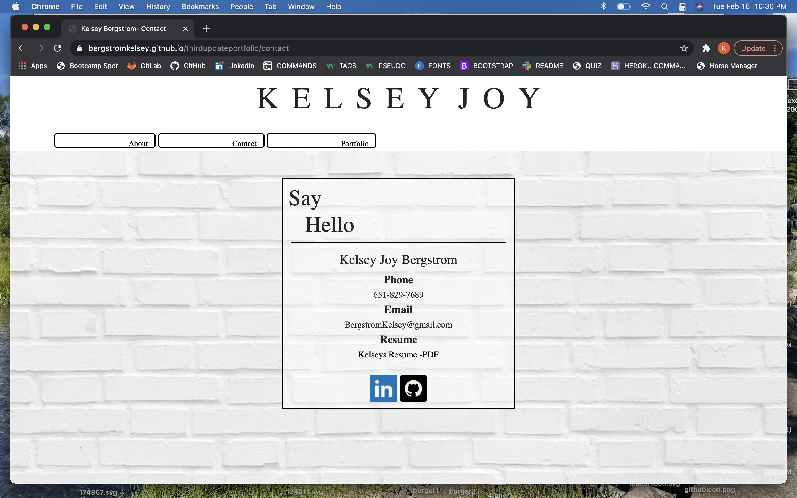
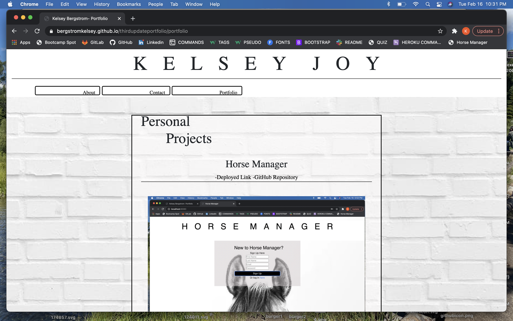
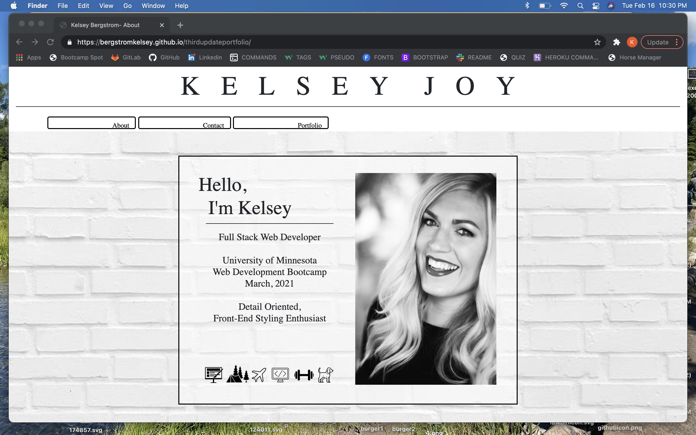

# thirdupdateportfolio

This project was another great way to showcase my work. This was the third update to my portfolio since the start of the Development Bootcamp, and it is really great to be able to compare this updated portfolio to the others, I can really see just how much I've learned. I can tell that my not only my knowledge but my speed with coding has improved. Overall, I am starting to really enjoy Front-end styling the most, I think this is the direction I would like to go in when the Bootcamp is over! I loved styling!

live link: https://bergstromkelsey.github.io/thirdupdateportfolio/

